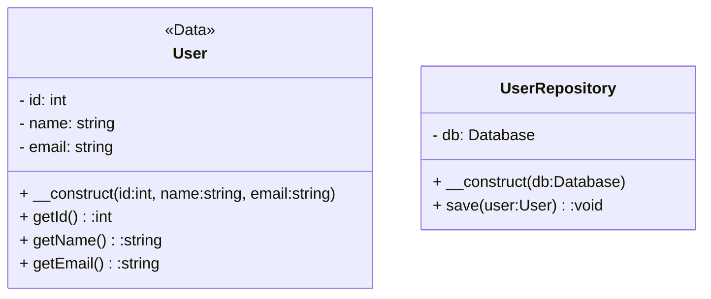
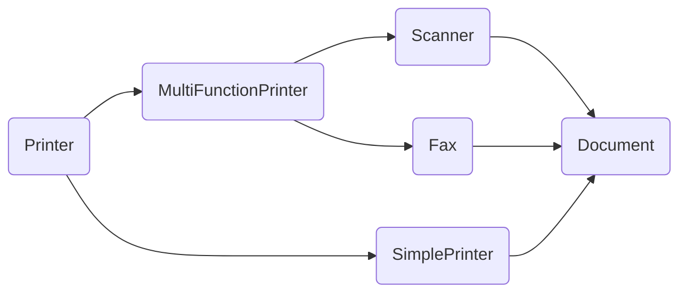

# [Tansoftware](https://www.tansoftware.com) - Les principes SOLID [](https://raw.githubusercontent.com/gosquared/flags/master/flags/flags/shiny/24/France.png)


# Table des matières
- [Introduction](#introduction)
- [Principes SOLID](#principes-solid)
    - [Single Responsibility Principle (SRP)](#single-responsibility-principle-srp)
     - [Open/Closed Principle (OCP)](#openclosed-principle-ocp)
     - [Liskov Substitution Principle (LSP)](#liskov-substitution-principle-lsp)
    - [Interface Segregation Principle (ISP)](#interface-segregation-principle-isp)
    - [Dependency Inversion Principle (DIP)](#dependency-inversion-principle-dip)

## Introduction
Introduits par [Robert C. Martin](http://cleancoder.com/products), également connu sous le nom de "Uncle Bob", dans son livre "[Agile Software Development: Principles, Patterns, and Practices](https://www.amazon.fr/Software-Development-Principles-Patterns-Practices/dp/0135974445)" publié en 2003, les principes SOLID sont une série de principes qui sont considérés comme des bonnes pratiques pour la conception de logiciels extensibles, évolutifs et faciles à maintenir.

## Principes SOLID

### Single Responsibility Principle (SRP)

Le principe de responsabilité unique stipule qu'une classe doit avoir **une seule raison de changer**. 

En étant responsable d'une seule tâche ou fonctionnalité, ce principe garantit que les classes sont faciles à comprendre, à maintenir et à étendre.

#### Explication

Le **SRP** réduit la complexité en divisant une fonctionnalité en sous-fonctionnalités distinctes et permet également de mieux organiser le code. 

#### Considérons le code suivant 

```php
class UserRepository {
    public function save(User $user) {
        // Enregistrer l'utilisateur dans la base de données
    }
}

class User {
    private $id;
    private $name;
    private $email;

    public function __construct($id, $name, $email) {
        $this->id = $id;
        $this->name = $name;
        $this->email = $email;
    }

    public function getId() {
        return $this->id;
    }

    public function getName() {
        return $this->name;
    }

    public function getEmail() {
        return $this->email;
    }
}
```
Dans cet exemple, la classe `UserRepository` s'occupe d'enregistrer les utilisateurs dans la base de données. Cette classe a une seule responsabilité, car elle ne fait qu'une seule chose : enregistrer les utilisateurs. 

La classe `User` représente simplement un utilisateur et n'a pas d'autres responsabilités.

Si nous avions ajouté la responsabilité de la validation des utilisateurs à la classe `UserRepository`, cela aurait **violé** le SRP. 

#### Pourquoi ?
La validation des utilisateurs est une responsabilité distincte qui doit être gérée par une autre classe.

#### Illustration

#### En savoir plus
Un article de Tansoftware est disponible sur le sujet [ici](https://tansoftware.com/community/article/comprendre-les-principes-solid---s). 
N'hésitez pas à le consulter.

[🔝 Retour en haut de page](#table-des-matières)

### Open/Closed Principle (OCP)

Le principe **ouvert/fermé** stipule qu'une classe doit être ouverte pour l'extension mais fermée pour la modification. Cela signifie qu'il est possible d'étendre le comportement d'une classe sans la modifier directement. 

En d'autres termes, une classe doit être facilement extensible mais difficile à modifier.

En respectant ce principe, les modifications apportées à une classe n'affecteront pas les autres parties du code. Chaque classe est indépendante et les modifications apportées à une classe n'affectent pas le fonctionnement des autres classes.

#### Exemple
```php
class Rectangle {
    public $width;
    public $height;

    public function __construct($width, $height) {
        $this->width = $width;
        $this->height = $height;
    }

    public function getArea() {
        return $this->width * $this->height;
    }
}

class Circle {
    public $radius;

    public function __construct($radius) {
        $this->radius = $radius;
    }

    public function getArea() {
        return pi() * $this->radius * $this->radius;
    }
}

class AreaCalculator {
    public function calculate($shapes) {
        $area = 0;
        foreach ($shapes as $shape) {
            $area += $shape->getArea();
        }
        return $area;
    }
}
```
Dans cet exemple, nous avons deux classes : `Rectangle` et `Circle`, qui calculent l'aire de leur forme respective. Nous avons également une classe `AreaCalculator` qui calcule l'aire de toutes les formes en utilisant la méthode `getArea()` de chaque classe.

Si nous devions ajouter une troisième forme, comme `Triangle`, nous devrions modifier la classe `AreaCalculator` pour prendre en compte cette nouvelle forme. Cela violerait le principe ouvert/fermé, car nous avons modifié la classe existante plutôt que de l'étendre.

#### Mise en pratique

Pour respecter le principe ouvert/fermé, nous pouvons créer une nouvelle classe `Triangle` qui étend la classe abstraite `Shape`. La classe `AreaCalculator` peut alors fonctionner avec n'importe quelle classe qui étend `Shape`.

```php
abstract class Shape {
    abstract public function getArea();
}

class Rectangle extends Shape {
    public $width;
    public $height;

    public function __construct($width, $height) {
        $this->width = $width;
        $this->height = $height;
    }

    public function getArea() {
        return $this->width * $this->height;
    }
}

class Circle extends Shape {
    public $radius;

    public function __construct($radius) {
        $this->radius = $radius;
    }

    public function getArea() {
        return pi() * $this->radius * $this->radius;
    }
}

class Triangle extends Shape {
    public $base;
    public $height;

    public function __construct($base, $height) {
        $this->base = $base;
        $this->height = $height;
    }

    public function getArea() {
        return ($this->base * $this->height) / 2;
    }
}

class AreaCalculator {
    public function calculate($shapes) {
        $area = 0;
        foreach ($shapes as $shape) {
            $area += $shape->getArea();
        }
        return $area;
    }
}
```
Maintenant, nous pouvons ajouter de nouvelles formes simplement en étendant la classe abstraite `Shape`. 

La classe `AreaCalculator` ne nécessite aucune modification, car elle fonctionne avec n'importe quelle classe qui étend `Shape`.

[🔝 Retour en haut de page](#table-des-matières)

### Liskov Substitution Principle (LSP)

Le principe de **substitution de Liskov (LSP)** décrit comment les sous-classes doivent être conçues pour pouvoir remplacer leurs classes de base sans affecter le comportement du programme. 

Dit autrement, si une classe A peut être remplacée par une classe B, alors B doit être une sous-classe de A et doit fonctionner de manière identique à A. 

L'objectif du LSP est de garantir que les sous-classes peuvent être utilisées de manière interchangeable avec leurs classes de base sans que cela ne modifie le comportement global du programme. 

Pour ce faire, les sous-classes doivent respecter les contrats établis par leurs classes de base et ne pas introduire de nouveaux comportements qui ne sont pas compatibles avec ceux de la classe de base.

#### Exemple
```csharp
class Rectangle { 
	int width; 
	int height;

	public void setWidth(int width) {
	    this.width = width;
	}

	public void setHeight(int height) {
	    this.height = height;
	}

	public int getArea() {
	    return width * height;
	}
}

class Square extends Rectangle { 
	@Override public void setWidth(int width) { 
		this.width = width; 
		this.height = width; 
	}

	@Override
	public void setHeight(int height) {
	    this.width = height;
	    this.height = height;
	}
}
```
#### Test
```csharp
void testRectangle(Rectangle r) { 
	r.setWidth(5); 
	r.setHeight(4);
    assertEquals(20, r.getArea());
}

testRectangle(new Rectangle()); // OK 
testRectangle(new Square()); // Échoue
```
Dans cet exemple, la classe `Square` étend la classe `Rectangle`, mais elle ne respecte pas le principe de substitution de Liskov. Les méthodes `setWidth` et `setHeight` sont redéfinies pour forcer la largeur et la hauteur à être les mêmes, ce qui est en contradiction avec la définition de la classe `Rectangle`. En conséquence, lorsqu'un objet `Square` est utilisé à la place d'un objet `Rectangle`, le comportement du programme est modifié.

Pour respecter le principe de substitution de Liskov, la classe `Square` devrait plutôt étendre une classe qui représente un quadrilatère régulier, où la largeur et la hauteur sont toujours identiques.

[🔝 Retour en haut de page](#table-des-matières)


### Interface Segregation Principle (ISP)

Le principe **de ségrégation des interfaces** stipule qu'une classe ne doit pas être forcée de dépendre d'interfaces qu'elle n'utilise pas. 

Une interface doit être spécifique à un objectif et ne doit pas contenir de méthodes qui ne sont pas nécessaires à cet objectif.

Le but de ce principe est de réduire le couplage entre les classes et d'améliorer la flexibilité et la facilité de maintenance du code.

#### Mise en œuvre
```java
interface Printer {
    void print(Document d);
}

interface Scanner {
    void scan(Document d);
}

interface Fax {
    void fax(Document d);
}

class MultiFunctionPrinter implements Printer, Scanner, Fax {
    public void print(Document d) {
        // implémentation de l'impression
    }

    public void scan(Document d) {
        // implémentation de la numérisation
    }

    public void fax(Document d) {
        // implémentation de la télécopie
    }
}

class SimplePrinter implements Printer {
    public void print(Document d) {
        // implémentation de l'impression
    }
}

```

Dans cet exemple, la classe `MultiFunctionPrinter` implémente trois interfaces distinctes `Printer`, `Scanner` et `Fax`, tandis que la classe `SimplePrinter` n'implémente que l'interface `Printer`. Cela permet de créer des classes spécialisées qui ne dépendent que des interfaces nécessaires pour leur fonctionnement.
#### Illustration


[🔝 Retour en haut de page](#table-des-matières)

### Dependency Inversion Principle (DIP)

Le principe **d'inversion des dépendances** est le cinquième et dernier principe SOLID. Il stipule que les modules de haut niveau ne doivent pas dépendre de modules de bas niveau, mais plutôt d'abstractions. 

Ce qui signifie que les abstractions ne doivent pas dépendre des détails, mais les détails doivent dépendre des abstractions.

Le DIP vise à réduire le couplage entre les différentes parties d'un système logiciel, ce qui rend le code plus flexible et plus facile à maintenir. 

En suivant ce principe, il est possible de modifier les détails de l'implémentation sans affecter les autres parties du système.

#### Exemple

Prenons l'exemple d'une application de gestion de stock pour un magasin. Le code pourrait être structuré en utilisant deux modules principaux : un module `Product` pour représenter les produits et un module `Inventory` pour gérer le stock. Cependant, le module `Inventory` dépend directement du module `Product`, ce qui crée un couplage fort entre les deux.

Pour résoudre ce problème, on peut appliquer le principe DIP en introduisant une interface `IProduct` qui sera implémentée par la classe `Product`. Le module `Inventory` pourra alors dépendre de l'interface `IProduct` plutôt que de la classe `Product` elle-même. Ainsi, si les détails de l'implémentation de la classe `Product` changent, cela n'affectera pas le module `Inventory`.

#### Code

```php
interface IProduct {
  public function getId();
  public function getName();
  public function getPrice();
}

class Product implements IProduct {
  private $id;
  private $name;
  private $price;

  public function __construct($id, $name, $price) {
    $this->id = $id;
    $this->name = $name;
    $this->price = $price;
  }

  public function getId() {
    return $this->id;
  }

  public function getName() {
    return $this->name;
  }

  public function getPrice() {
    return $this->price;
  }
}

class Inventory {
  private $products;

  public function __construct() {
    $this->products = array();
  }

  public function addProduct(IProduct $product) {
    $this->products[] = $product;
  }

  public function getProducts() {
    return $this->products;
  }
}
```
Dans cet exemple, la classe `Inventory` dépend de l'interface `IProduct` plutôt que de la classe `Product`. La classe `Product` implémente l'interface `IProduct`, mais le module `Inventory` n'a pas besoin de le savoir. 

Si la classe `Product` change, cela n'affectera pas le module `Inventory`.

[🔝 Retour en haut de page](#table-des-matières)
